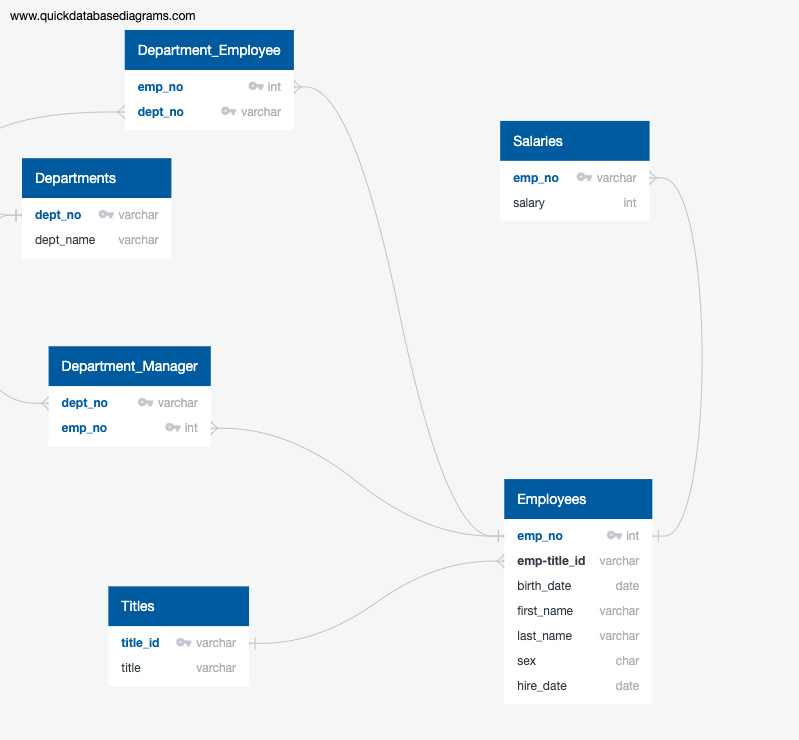

# sql-challenge
In this challenge a schema was designed, tables were made to hold the data from csv!

[ERD Image](https://user-images.githubusercontent.com/40581033/218742982-76934b2e-e991-4cd8-8c53-aa2147bf464a.png)

Eight queries were completed and sql and views were made to store the queries.

